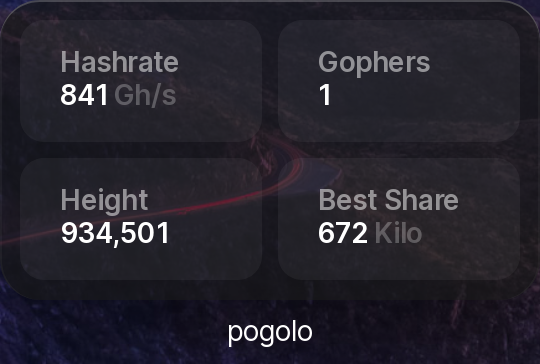

# pogolo widget API server for umbrelOS

Forked from https://github.com/getumbrel/umbrel-public-pool-widget



This is a server application that fetches data from a specified pogolo instance's API and serves it in a formatted JSON response that's expected by umbrelOS 1.0+ to display a widget. 

The server is built using the bun JavaScript runtime and toolkit, and is containerized as a distroless Docker image for umbrelOS.

## Application overview

The server application is defined in `index.ts`. It fetches data from the upstream pogolo API, formats the data into a specific JSON structure, and serves the formatted data at the `/widgets/pool` endpoint.

If the pogolo API request fails for any reason, the handler returns a default response with placeholder data, so that the umbrelOS widget will still show headers for the values.

## Docker overview

The Dockerfile defines a multi-stage Docker build process. The first stage uses the official bun image to compile the server application into a binary. The second stage uses a distroless glibc image to create a minimal Docker image. The compiled binary is copied from the first stage into the second stage, and the binary is run when a container is started from the image.

The Dockerfile uses build arguments to target specific architectures (x86 and arm64) during the build process. The `TARGETPLATFORM` argument is used to select the appropriate bun target for the architecture.

## Running locally

To run the server, you can build and run a Docker container using the Dockerfile. The server will start on port 3000 and will serve data at the `/widgets/pool` endpoint.

> Note: You will need to set the `POGOLO_API_URL` environment variable to the host of your upstream API before starting the server.

To install dependencies:

```bash
bun install
```

To run:

```bash
bun run index.ts
```

This project was created using `bun init` in bun v1.2.2. [Bun](https://bun.sh) is a fast all-in-one JavaScript runtime.
